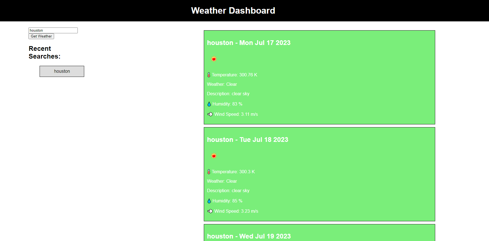

# WeatherDashboard-Challenge6-ServerSideAPIs

<h2>Project Description - For bootcamp challenge 6:<h2> 

<h3>This project is a weather dashboard that is able to tell you the weather of the current date and up to 4 days in advanced as well display various different features such as:

- Date & Day
- Temperature
- Weather & Description
- Humidity
- Wind speed 
- Recent searches section

<h2>No installation is required.<h2>

<h2>Additional Credits - N/A

<h2>How to use:<h2>

<h3>The project will display the weather in whichever city you search for !note; cities have to be search for with proper name. It also has local storage to research locations<h3>

<h2>License - MIT License<h2>
<h3>Refer to license to see permissions<h3>

<h2>https://bemonn.github.io/WeatherDashboard-Challenge6-ServerSideAPIs/   
<h2>

<h2> Weather Dashboard in action! <h2>

